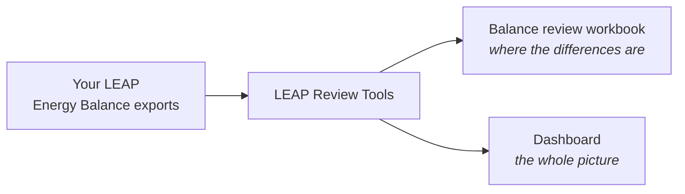
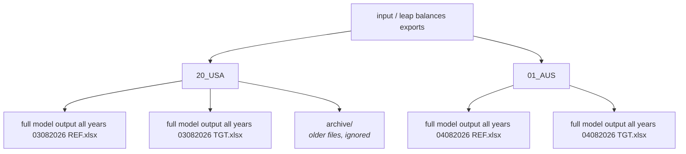
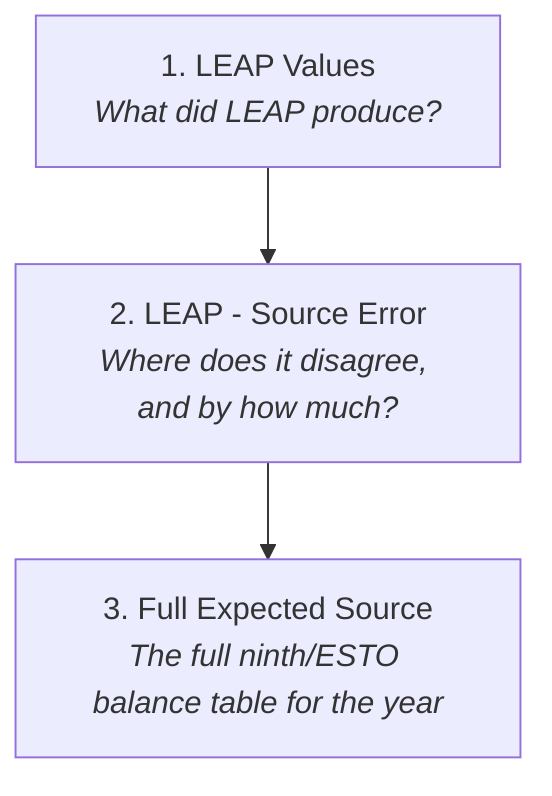

# Welcome

These two tools help you check a LEAP model against the source data it should
agree with.

The **balance review** produces an Excel workbook that shows, cell by cell, where
your LEAP energy balance differs from the source data — and by how much. It is
the tool to reach for when you want to know what to fix.

The **dashboard** produces a set of interactive web pages comparing LEAP against
ESTO and the 9th Outlook across every sector and fuel. It is the tool to reach
for when you want to see the whole picture, or show it to someone else.

There is nothing to install. Everything the tools need is already in the folder
you were sent. You give them your LEAP exports, and they give you back a workbook
or a dashboard.



\newpage

# Before you start

**Extract the folder somewhere simple.** `C:\Tools\` is ideal. Avoid extracting
it deep inside a OneDrive or Documents folder — long paths cause problems.

**Windows will warn you the first time.** You will see a blue box saying "Windows
protected your PC". This is expected: the program has not been registered with
Microsoft. Click **More info**, then **Run anyway**. You only need to do this
once.

**You do not need Excel to run the tools.** You only need it to open the workbook
afterwards. When you do open it, Excel will recalculate the sheet — that is
normal and takes a moment.

To work with the tools, open the folder in File Explorer, hold Shift, right-click
in an empty area, and choose *Open PowerShell window here*. You will type short
commands there. Each one in this guide can be copied exactly as written.

\newpage

# Putting your files in

There is one folder you need to care about: **`input\leap balances exports`**.

A folder is already there for every economy. Put each economy's LEAP Energy
Balance exports into its folder — you do not need to create anything.



This is the same layout the modelling team uses, so you can copy a folder
straight across in either direction.

## Naming your files

Two things need to be in the filename:

* a **four-digit date**, day then month — `0804` for the 8th of April;
* a **scenario code** — `REF` or `TGT`. `Reference` and `Target` also work.

Anything else in the name is up to you, and the order does not matter. All of
these are fine:

```text
0804 TGT.xlsx
TGT 0804.xlsx
USA balance 0804 Target.xlsx
full model output all years 04082026 TGT.xlsx
```

A longer date works too, so `04082026` is read the same as `0804`.

**If you have several files for one economy and scenario, the newest date wins.**
That is what the date is for. You do not have to delete the older ones — leave
them and the tools will use the most recent. If you would rather they were out of
the way, make a folder called `archive` inside the economy folder and move them
there; anything in `archive` is ignored completely.

If a file cannot be matched to a scenario, the tools read the workbook itself to
work it out, so a slightly different name usually still works. Run `list` to see
what has actually been picked up.

## One thing that matters

When you export the Energy Balance from LEAP, export it with **at least Level 2
detail**. A Level 1 export flattens everything into single rows, which leaves
nothing to compare. The tools check for this and will tell you plainly if an
export is too shallow, rather than producing a misleading result.

\newpage

# Checking it can see your files

Before running anything properly, ask the tools what they can find:

```text
.\leap-review-tools.exe list
```

You will get something like this:

```text
LEAP balance exports in: C:\Tools\leap-review-tools-0.1.0\input\leap balances exports

  01_AUS
      Reference  full model output all years 04082026 REF.xlsx  [2022-2060]
      Target     full model output all years 04082026 TGT.xlsx  [2022-2060]
  20_USA
      Reference  full model output all years 03082026 REF.xlsx  [2022-2060]
      Target     full model output all years 03082026 TGT.xlsx  [2022-2060]
```

Each economy is listed with the file chosen for each scenario and the years that
file covers. This is the quickest way to confirm your files are named correctly
and in the right place.

If a file is named in a way the tools do not recognise, it says so here rather
than quietly ignoring it. That is usually a typo in the date or the scenario.

\newpage

# Building a balance review

This gives you the Excel workbook showing where LEAP and the source data
disagree.

**Step 1.** Decide which economy, scenario and year you want to review. Most
reviews are for the base year, 2022.

**Step 2.** Run the command, changing the economy, scenario and year to suit:

```text
.\leap-review-tools.exe balance-review-from-export --economy 20_USA --scenario Target --year 2022
```

You do not have to tell it which file to use — it finds the right export for that
economy and scenario itself.

**Step 3.** Wait. It will print its progress as it works. It reads your export,
compares every value against the source data, and builds the workbook.

**Step 4.** Open the result:

```text
output\20_USA\balance_review\balance_review_20_USA_tgt_2022.xlsx
```

The next section explains what you are looking at.

If you already have a diagnostics folder from the modelling team, you can use it
directly instead — that is the `balance-review` command, and it takes the folder
as `--diagnostics-directory`. Ask whoever sent you the tools if you are not sure
which applies to you.

\newpage

# Reading the balance-review workbook

## How the comparison is made

You export the balance table from LEAP. The tools then compare those results
against the original source data and identify every difference. The workbook is
that comparison, laid out in the shape of the balance table you already know.

So a difference is a disagreement between the model and the source — not a
verdict about which one is wrong.

## The three sheets

They are meant to be read in order, and each answers a different question.



**LEAP Values** is your energy balance exactly as LEAP produced it, converted to
petajoules. Nothing has been changed. Use it to get your bearings — the rows and
columns are the ones you already know.

**LEAP - Source Error** is the heart of it. Each cell shows LEAP minus the
source. A red cell means they disagree, and the number is the size of the gap.
A grey zero means they agree. This is your worklist: start with the largest red
numbers.

**Full Expected Source** shows the full ninth/ESTO balance table for the selected
year. It includes the source values and greys out cells that do not exist in the
LEAP balance structure, so it also answers "is this missing, or is it just not
applicable here?"

Missing and unavailable comparison rows are still counted in the run summary and
remain available in the diagnostic CSV outputs. They are no longer copied into a
separate workbook sheet, so the review workbook stays focused on the three core
balance views.

## Where the differences come from

A difference on the error sheet is not automatically a mistake in LEAP. It is a
disagreement between two things, and it can come from any of three places.

**1. LEAP is not calculating what the comparison expects.** The fix is either to
change the LEAP calculation method — the supply rules Luthfi teaches, for
example — or to change the inputs generated for LEAP so it produces the intended
result.

**2. The comparison itself is wrong.** The mapping between the source data and
the LEAP balance categories may be incorrect, or there may be a problem in the
code applying it. These are being worked through steadily, and fixing them
improves several other parts of the process at the same time.

**3. The baseline seed values are wrong.** Then the seed generation needs fixing
and the seed files rebuilding, as is being done for refining.

Worth holding all three in mind before changing anything: the most common
instinct is to assume the first, and a good share of what turns up is the second.


# Building a dashboard

This gives you interactive web pages comparing LEAP against ESTO and the 9th
Outlook.

```text
.\leap-review-tools.exe dashboard-from-export --economy 20_USA
```

This one takes longer — a few minutes — because it reads every export you have
for that economy, works out the comparison, and then draws several hundred
charts. It prints its progress as it goes.

When it finishes, open:

```text
output\20_USA\dashboard\dashboards\index.html
```

It opens in your web browser. No internet connection is needed; everything is in
the folder.

Down the side you will find a page per sector. Each chart shows up to three
series: what LEAP produced, what ESTO recorded, and what the 9th Outlook
projects. Historical years compare against ESTO; projection years compare against
the 9th. You can click series names in the legend to hide or show them.

Some sector pages may be missing. That is deliberate: if LEAP has no separately
modelled detail for a sector in that economy, a page would be misleading, so it
is left out. The run tells you which ones and why.

\newpage

# Where your results go

Everything is grouped by economy, so nothing you produce overwrites anything
else.

```text
output/
  20_USA/
    balance_review/    workbooks for the USA
    dashboard/         the USA dashboard
  01_AUS/
    balance_review/
    dashboard/
```

You can review the USA today and Australia tomorrow and both remain in place.
Within an economy, workbooks for different scenarios and years sit side by side,
because the scenario and year are part of each filename.

Beside your results you will find a `run_records` folder. Each run leaves a dated
record in there showing exactly which files it used and when. You can ignore it
day to day — it is there so that months later you can answer "which export did
this come from?" with certainty rather than memory.

\newpage

# If something goes wrong

The tools try to explain problems in plain language rather than showing an error
you would need a programmer to read. Work through these in order.

**Start here.** This confirms the folder is complete and working:

```text
.\leap-review-tools.exe selfcheck
```

You want to see `result : OK`.

**Read the validation report.** Every run leaves one in its `run_records` folder,
whether it succeeded or not. If a run stopped, this file says which input was
wrong and what was expected. Most problems are answered here.

**Check what it can see.** Run `list` again. A surprising number of problems are
a file in the wrong folder or a date typed differently from the filename.

**If a run failed, no result was produced.** The tools do not write a partial
workbook or a half-finished dashboard. You will not accidentally use a broken
output.

**Send a support bundle.** Add `--support-bundle` to any command and you get a
ZIP in the output folder containing the run record, the checks that ran, and the
logs. It deliberately contains none of your data, so it is safe to email.

\newpage

# Updating settings without a new version

Beside the program there is a folder called `config`. It holds the settings the
tools use: which sectors appear on which dashboard page, the colours, the series
labels, and the mapping information behind the comparison.

If your modelling team sends you a replacement for one of these files, drop it in
and run again. The change takes effect immediately — you do not need a new
version of the program. Each run records which settings it used, so a result can
always be traced back to the exact files behind it.

If something behaves unexpectedly after a settings change, that record is the
first thing to check.

\newpage

# About the reference data

Your LEAP model is compared against two reference datasets that come with the
tools: the ESTO historical data, and the 9th Outlook projections. You do not need
to supply either — they are already in the folder.

The ESTO data is reissued once a year, and each new issue moves the base year
along. The version in your copy is the 2024 issue, with a base year of 2022. When
the 2026 issue arrives the base year becomes 2024, and so on.

**You can use a newer ESTO file without waiting for a new version of the tools.**
Point either command at it:

```text
.\leap-review-tools.exe dashboard-from-export --economy 20_USA --esto-table-path "input\00APEC_2026_low_with_subtotals.csv"
```

Both tools then use your file, and the base year moves with it automatically —
the tools read it from the file rather than being told. The comparison rows are
rebuilt from your data the first time you use a given file, which adds a couple
of minutes; after that it is remembered.

Two things worth knowing. An ESTO update does not change the projections — the
9th Outlook is finished and will not be reissued. In future this comparison may
be run against a different projection instead, with its own mappings to the LEAP
and ESTO data; the tools are built to accommodate that when it happens. And each
run records which file it used, so a result can always be traced back to the data
behind it.

If you would rather not manage this yourself, that is fine too: your modelling
team will send a new version of the tools with the newer data already in it.

## Please never edit the reference data

It is a plain spreadsheet file, so it can be opened and changed — but please
don't, even to correct something that looks wrong.

The tools already add the rows a particular ESTO issue is missing. Newer
categories such as datacentres and hydrogen transformation are filled in
automatically from a reviewed list, with zero values, so the structure is
complete. A row you add by hand skips that review and will not match what the
comparison expects.

The tools also adjust the data as they read it — own-use and loss rows are
sign-corrected, and subtotal rows are set aside so nothing is counted twice. So a
value in the file will not always look like the value in your results, and that
is correct rather than a sign of a problem.

Every run records exactly which reference files it used. A file that has been
edited by hand is one nobody else has, which means a result built on it cannot be
reproduced or checked by anyone else.

If a value looks wrong, or a row you expect is missing, that is worth raising —
it is usually a question about the mapping rather than something to patch in the
data.

\newpage

# Quick reference

See what the tools can find:

```text
.\leap-review-tools.exe list
```

Check the folder is intact:

```text
.\leap-review-tools.exe selfcheck
```

Build a balance-review workbook:

```text
.\leap-review-tools.exe balance-review-from-export --economy 20_USA --scenario Target --year 2022
```

Build a dashboard:

```text
.\leap-review-tools.exe dashboard-from-export --economy 20_USA
```

See what this copy contains and where it writes:

```text
.\leap-review-tools.exe info
```

Any command also accepts `--run-label` to name a run, and `--support-bundle` to
package up its record for sending on.

If you prefer not to type commands, double-click the program. It will ask you
what you want to do and take you through the inputs one at a time.
